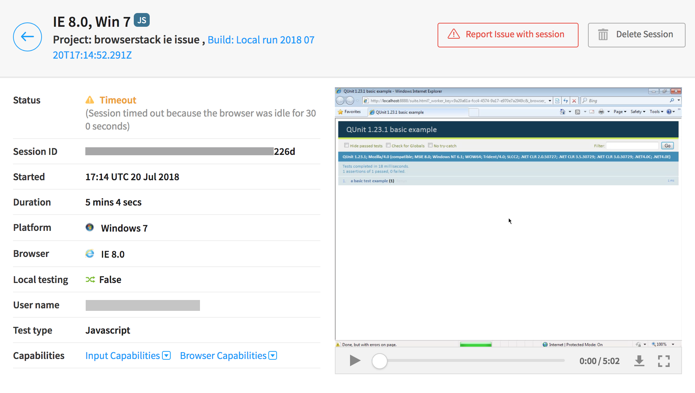
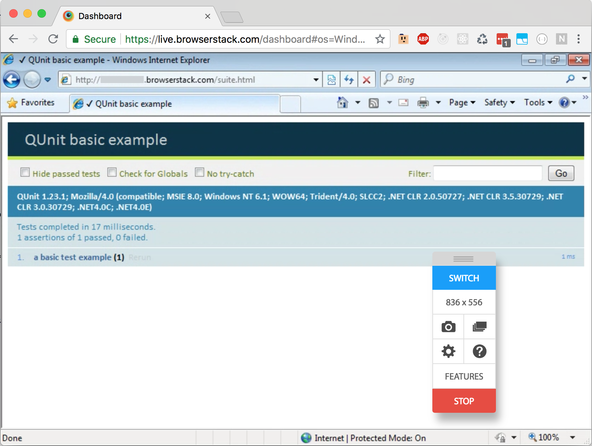

# Browserstack IE Issue Repro
Reproduces a timeout issue when running QUnit tests on IE 6-8 using the latest node-based browserstack-runner, v0.7.0.

## Usage / Reproduction Steps
First, set environment variables: `BROWSERSTACK_USERNAME` and `BROWSERSTACK_KEY`, then

```
npm i
npm run test
```

This will run this basic QUnit example setup in suite.html using QUnit 1.23.1 on the following browsers: IE 6, IE 7, IE 8, and IE 9.
Only IE 9 will pass the tests according the the automate API and UI. IE 6-8 will timeout.

```
Launching 4 worker(s) for 4 run(s).
[Windows 7, Internet Explorer 9.0] Passed: 1 tests, 1 passed, 0 failed, 0 skipped; ran for 0ms
All tests done, failures: 3.
```

## The Issue

IE 6-8 timeout with a javascript error at the bottom of the page, but the recorded video shows the tests passed:

IE 8 automate screenshot:


However, if you run the tests in browserstack live with the same browser/OS configuration, the tests succeed and there is no javascript error.

IE 8 live screenshot:

